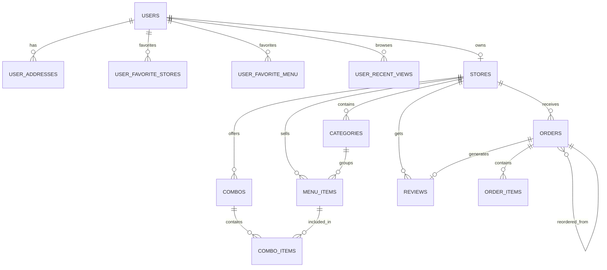

# 数据库设计说明文档

## 1. 文档说明

本文档用于说明“智能外卖管理平台”当前版本的 MySQL 数据库设计方案，覆盖以下内容：

- 数据库整体设计目标
- E-R 关系说明
- 各表结构说明
- 字段含义说明
- 主键、逻辑外键与索引设计
- 当前实现特点与后续优化建议

当前项目的数据库实现文件主要包括：

- `mysql_storage.py`：MySQL 连接、初始化、数据装载与持久化逻辑
- `mysql_schema.sql`：数据库建表脚本

数据库名称默认配置为：`intelligent_food_delivery`

## 2. 设计目标

本系统面向三类端口和三类角色：

- 用户端：用户登录、浏览店铺、搜索店铺、搜索菜品、购物车、下单、评价、收藏、复购、智能服务入口
- 商家端：商家登录、店铺管理、分类管理、菜品管理、套餐管理、订单管理、经营分析
- 管理端：管理员登录、用户管理、商家管理、智能服务监控

数据库设计的核心目标如下：

- 支持多店铺模型，每个商家账号对应一个店铺
- 支持店铺下的分类、菜品、套餐等经营实体
- 支持订单、订单明细、评价等交易闭环数据
- 支持收藏、浏览记录、复购来源等用户行为数据
- 支持管理端对用户、商家、经营状态进行统一管理
- 保持现有 Flask 业务逻辑平滑迁移，优先保证结构可落地和兼容性

## 3. 数据库总体划分

从业务上，数据库可划分为 6 个主题域：

1. 账户与角色域
2. 店铺与商品域
3. 交易订单域
4. 用户行为域
5. 评价反馈域
6. 系统元数据域

对应表如下：

- 账户与角色域：`users`
- 店铺与商品域：`stores`、`categories`、`menu_items`、`combos`、`combo_items`
- 交易订单域：`orders`、`order_items`
- 用户行为域：`user_addresses`、`user_favorite_stores`、`user_favorite_menu`、`user_recent_views`
- 评价反馈域：`reviews`
- 系统元数据域：`counters`、`app_meta`

## 4. E-R 关系设计

## 4.1 核心实体

系统核心实体包括：

- 用户 `User`
- 店铺 `Store`
- 分类 `Category`
- 菜品 `MenuItem`
- 套餐 `Combo`
- 订单 `Order`
- 评价 `Review`

## 4.2 核心关系说明

1. 一个用户可以拥有多个地址。
2. 一个商家用户对应一个店铺，店铺通过 `owner_user_id` 关联到商家账户。
3. 一个店铺可以有多个分类。
4. 一个分类下可以有多个菜品。
5. 一个店铺可以有多个套餐。
6. 一个套餐可以包含多个菜品，通过 `combo_items` 实现多对多关联。
7. 一个用户可以产生多个订单。
8. 一个订单包含多条订单明细，通过 `order_items` 表表示。
9. 一个订单完成后可以产生一条评价。
10. 用户可以收藏多个店铺，也可以收藏多个菜品。
11. 用户可以保留最近浏览记录，记录浏览的店铺或菜品。
12. 一个订单可以来源于历史订单复购，通过 `source_order_id` 记录来源订单。

## 4.3 E-R 关系图

## 4.4 关于外键的说明

当前项目数据库中，大部分“关联关系”是通过字段进行逻辑关联，而不是在 MySQL 层面显式声明 `FOREIGN KEY` 约束。

这样设计的原因主要是：

- 当前系统是从 JSON 数据存储平滑迁移到 MySQL
- 业务层仍以整体数据装载和回写为主
- 先保证现有功能兼容，再逐步强化数据库约束

因此，本文档中会区分：

- 物理主键：数据库中真实声明的 `PRIMARY KEY`
- 逻辑外键：业务上表示关联，但当前未显式定义 `FOREIGN KEY`

## 5. 表结构设计说明

## 5.1 `users` 用户表

### 5.1.1 业务用途

用于存储系统全部账号信息，包括：

- 普通用户账号
- 商家账号
- 管理员账号

### 5.1.2 表结构

| 字段名 | 类型 | 约束 | 含义 |
|---|---|---|---|
| `id` | `INT` | `PRIMARY KEY` | 用户主键 ID |
| `username` | `VARCHAR(64)` | `NOT NULL` `UNIQUE` | 登录用户名 |
| `password` | `VARCHAR(255)` | `NOT NULL` | 登录密码 |
| `phone` | `VARCHAR(32)` | `NOT NULL DEFAULT ''` | 手机号 |
| `role` | `VARCHAR(16)` | `NOT NULL` | 角色类型，如 `customer`、`merchant`、`admin` |
| `account_status` | `VARCHAR(16)` | `NOT NULL DEFAULT 'active'` | 账户状态 |
| `risk_status` | `VARCHAR(16)` | `NOT NULL DEFAULT 'normal'` | 风险状态 |
| `admin_note` | `TEXT` |  | 管理员备注 |
| `store_id` | `INT` | `NULL` | 商家关联店铺 ID |
| `store_name` | `VARCHAR(255)` | `NOT NULL DEFAULT ''` | 商家店铺名称冗余字段 |
| `store_description` | `TEXT` |  | 店铺描述冗余字段 |
| `created_at` | `VARCHAR(32)` | `NOT NULL DEFAULT ''` | 创建时间 |

### 5.1.3 主外键设计

- 主键：`id`
- 唯一键：`username`
- 逻辑外键：`store_id -> stores.id`

### 5.1.4 设计说明

- 商家账号与店铺存在一对一映射关系，但由于迁移兼容，`users` 和 `stores` 中都保留了部分店铺信息。
- `role` 字段承担权限分流作用，是三端登录的重要依据。
- `account_status` 和 `risk_status` 服务于管理端用户管理与风控管理。

## 5.2 `user_addresses` 用户地址表

### 5.2.1 业务用途

用于保存用户收货地址信息。

### 5.2.2 表结构

| 字段名 | 类型 | 约束 | 含义 |
|---|---|---|---|
| `user_id` | `INT` | `NOT NULL` | 用户 ID |
| `address_id` | `INT` | `NOT NULL` | 地址序号 |
| `name` | `VARCHAR(255)` | `NOT NULL` | 收货人姓名 |
| `address` | `TEXT` | `NOT NULL` | 收货地址 |
| `phone` | `VARCHAR(32)` | `NOT NULL` | 联系电话 |
| `is_default` | `TINYINT(1)` | `NOT NULL DEFAULT 0` | 是否默认地址 |
| `created_at` | `VARCHAR(32)` | `NOT NULL DEFAULT ''` | 创建时间 |

### 5.2.3 主外键设计

- 主键：`(user_id, address_id)`
- 逻辑外键：`user_id -> users.id`
- 索引：`idx_user_addresses_user_id(user_id)`

### 5.2.4 设计说明

- 使用联合主键，确保同一用户下地址序号唯一。
- 查询场景主要是“按用户查地址列表”，因此对 `user_id` 建索引。

## 5.3 `user_favorite_stores` 用户收藏店铺表

### 5.3.1 业务用途

用于表示用户与店铺之间的收藏关系。

### 5.3.2 表结构

| 字段名 | 类型 | 约束 | 含义 |
|---|---|---|---|
| `user_id` | `INT` | `NOT NULL` | 用户 ID |
| `store_id` | `INT` | `NOT NULL` | 店铺 ID |

### 5.3.3 主外键设计

- 主键：`(user_id, store_id)`
- 逻辑外键：`user_id -> users.id`
- 逻辑外键：`store_id -> stores.id`
- 索引：`idx_user_favorite_stores_store_id(store_id)`

### 5.3.4 设计说明

- 这是典型的多对多关系中间表。
- 联合主键保证同一用户不会重复收藏同一家店铺。

## 5.4 `user_favorite_menu` 用户收藏菜品表

### 5.4.1 业务用途

用于表示用户与菜品之间的收藏关系。

### 5.4.2 表结构

| 字段名 | 类型 | 约束 | 含义 |
|---|---|---|---|
| `user_id` | `INT` | `NOT NULL` | 用户 ID |
| `item_id` | `INT` | `NOT NULL` | 菜品 ID |

### 5.4.3 主外键设计

- 主键：`(user_id, item_id)`
- 逻辑外键：`user_id -> users.id`
- 逻辑外键：`item_id -> menu_items.id`
- 索引：`idx_user_favorite_menu_item_id(item_id)`

### 5.4.4 设计说明

- 该表支持用户端“收藏菜品”功能。
- 联合主键保证用户对同一菜品只保留一条收藏记录。

## 5.5 `user_recent_views` 用户最近浏览表

### 5.5.1 业务用途

用于记录用户最近浏览的店铺或菜品，支持“最近浏览记录”功能。

### 5.5.2 表结构

| 字段名 | 类型 | 约束 | 含义 |
|---|---|---|---|
| `user_id` | `INT` | `NOT NULL` | 用户 ID |
| `seq_no` | `INT` | `NOT NULL` | 浏览序号 |
| `view_type` | `VARCHAR(16)` | `NOT NULL` | 浏览对象类型，如 `store` 或 `item` |
| `store_id` | `INT` | `NULL` | 浏览的店铺 ID |
| `item_id` | `INT` | `NULL` | 浏览的菜品 ID |
| `viewed_at` | `VARCHAR(32)` | `NOT NULL DEFAULT ''` | 浏览时间 |

### 5.5.3 主外键设计

- 主键：`(user_id, seq_no)`
- 逻辑外键：`user_id -> users.id`
- 逻辑外键：`store_id -> stores.id`
- 逻辑外键：`item_id -> menu_items.id`
- 索引：`idx_user_recent_views_store_id(store_id)`

### 5.5.4 设计说明

- 使用 `view_type + store_id/item_id` 表示多态浏览对象。
- 当前仅对 `store_id` 建索引，适合店铺维度回查。
- 如果后续菜品浏览统计增强，建议增加 `item_id` 索引。

## 5.6 `stores` 店铺表

### 5.6.1 业务用途

用于保存平台中的店铺核心信息，是用户端店铺列表、店铺详情页、商家端店铺管理和管理端商家管理的核心表。

### 5.6.2 表结构

| 字段名 | 类型 | 约束 | 含义 |
|---|---|---|---|
| `id` | `INT` | `PRIMARY KEY` | 店铺主键 ID |
| `owner_user_id` | `INT` | `NULL` | 店主用户 ID |
| `name` | `VARCHAR(255)` | `NOT NULL` | 店铺名称 |
| `description` | `TEXT` |  | 店铺简介 |
| `status` | `VARCHAR(16)` | `NOT NULL DEFAULT 'active'` | 店铺状态 |
| `avatar_url` | `LONGTEXT` |  | 店铺头像 |
| `cover_image_url` | `LONGTEXT` |  | 店铺封面 |
| `business_status` | `VARCHAR(32)` | `NOT NULL DEFAULT '营业中'` | 营业状态 |
| `business_hours` | `VARCHAR(64)` | `NOT NULL DEFAULT '09:00-22:00'` | 营业时间 |
| `rating` | `DECIMAL(3,1)` | `NOT NULL DEFAULT 4.8` | 店铺评分 |
| `delivery_fee` | `DECIMAL(10,2)` | `NOT NULL DEFAULT 0` | 配送费 |
| `min_order_amount` | `DECIMAL(10,2)` | `NOT NULL DEFAULT 0` | 起送价 |
| `announcement` | `TEXT` |  | 店铺公告 |
| `created_at` | `VARCHAR(32)` | `NOT NULL DEFAULT ''` | 创建时间 |

### 5.6.3 主外键设计

- 主键：`id`
- 逻辑外键：`owner_user_id -> users.id`
- 索引：`idx_stores_owner_user_id(owner_user_id)`
- 索引：`idx_stores_status(status)`

### 5.6.4 设计说明

- 该表承载店铺首页卡片信息。
- `owner_user_id` 支撑“一个商家账号对应一个店铺”的业务模型。
- `status` 主要用于后台管理端统一上下架、启停或风险处置。

## 5.7 `categories` 店铺分类表

### 5.7.1 业务用途

用于保存店铺内部分类，如快餐、饮品、套餐、主食等。

### 5.7.2 表结构

| 字段名 | 类型 | 约束 | 含义 |
|---|---|---|---|
| `id` | `INT` | `PRIMARY KEY` | 分类主键 ID |
| `name` | `VARCHAR(255)` | `NOT NULL` | 分类名称 |
| `store_id` | `INT` | `NOT NULL` | 所属店铺 ID |
| `status` | `VARCHAR(16)` | `NOT NULL DEFAULT 'active'` | 分类状态 |

### 5.7.3 主外键设计

- 主键：`id`
- 逻辑外键：`store_id -> stores.id`
- 索引：`idx_categories_store_id(store_id)`
- 索引：`idx_categories_status(status)`

### 5.7.4 设计说明

- 一个店铺可以维护多条分类记录。
- 用户端店铺详情页的左侧分类导航主要依赖本表。

## 5.8 `menu_items` 菜品表

### 5.8.1 业务用途

用于保存店铺销售的单品菜品信息。

### 5.8.2 表结构

| 字段名 | 类型 | 约束 | 含义 |
|---|---|---|---|
| `id` | `INT` | `PRIMARY KEY` | 菜品主键 ID |
| `name` | `VARCHAR(255)` | `NOT NULL` | 菜品名称 |
| `description` | `TEXT` |  | 菜品描述 |
| `price` | `DECIMAL(10,2)` | `NOT NULL` | 菜品价格 |
| `category_id` | `INT` | `NOT NULL` | 分类 ID |
| `store_id` | `INT` | `NOT NULL` | 所属店铺 ID |
| `image` | `LONGTEXT` |  | 菜品图片 |
| `status` | `VARCHAR(16)` | `NOT NULL DEFAULT 'active'` | 菜品状态 |

### 5.8.3 主外键设计

- 主键：`id`
- 逻辑外键：`category_id -> categories.id`
- 逻辑外键：`store_id -> stores.id`
- 索引：`idx_menu_items_store_id(store_id)`
- 索引：`idx_menu_items_category_id(category_id)`
- 索引：`idx_menu_items_status(status)`

### 5.8.4 设计说明

- 菜品既关联分类也关联店铺，便于按分类和按店铺两种路径查询。
- 当前搜索功能可按店铺内菜品检索，该表是核心数据来源。

## 5.9 `combos` 套餐表

### 5.9.1 业务用途

用于保存店铺销售的套餐信息。

### 5.9.2 表结构

| 字段名 | 类型 | 约束 | 含义 |
|---|---|---|---|
| `id` | `INT` | `PRIMARY KEY` | 套餐主键 ID |
| `name` | `VARCHAR(255)` | `NOT NULL` | 套餐名称 |
| `description` | `TEXT` |  | 套餐描述 |
| `price` | `DECIMAL(10,2)` | `NOT NULL` | 套餐售价 |
| `discount` | `DECIMAL(10,2)` | `NOT NULL DEFAULT 1.0` | 套餐折扣系数 |
| `store_id` | `INT` | `NOT NULL` | 所属店铺 ID |
| `status` | `VARCHAR(16)` | `NOT NULL DEFAULT 'active'` | 套餐状态 |

### 5.9.3 主外键设计

- 主键：`id`
- 逻辑外键：`store_id -> stores.id`
- 索引：`idx_combos_store_id(store_id)`
- 索引：`idx_combos_status(status)`

### 5.9.4 设计说明

- 套餐作为独立经营实体，与单品菜品分表管理。
- `discount` 支撑套餐优惠表达，但当前仍保留价格冗余，方便直接计算订单金额。

## 5.10 `combo_items` 套餐菜品关联表

### 5.10.1 业务用途

用于表示套餐与菜品之间的多对多关系。

### 5.10.2 表结构

| 字段名 | 类型 | 约束 | 含义 |
|---|---|---|---|
| `combo_id` | `INT` | `NOT NULL` | 套餐 ID |
| `item_id` | `INT` | `NOT NULL` | 菜品 ID |
| `seq_no` | `INT` | `NOT NULL` | 套餐内排序号 |

### 5.10.3 主外键设计

- 主键：`(combo_id, item_id, seq_no)`
- 逻辑外键：`combo_id -> combos.id`
- 逻辑外键：`item_id -> menu_items.id`
- 索引：`idx_combo_items_item_id(item_id)`

### 5.10.4 设计说明

- 这是套餐展开展示和明细构成的关键中间表。
- `seq_no` 用于控制套餐内菜品显示顺序。

## 5.11 `orders` 订单表

### 5.11.1 业务用途

用于保存用户下单后的订单主信息。

### 5.11.2 表结构

| 字段名 | 类型 | 约束 | 含义 |
|---|---|---|---|
| `id` | `INT` | `PRIMARY KEY` | 订单主键 ID |
| `customer` | `VARCHAR(64)` | `NOT NULL` | 下单用户名 |
| `store_id` | `INT` | `NOT NULL` | 店铺 ID |
| `store_name` | `VARCHAR(255)` | `NOT NULL DEFAULT ''` | 店铺名称冗余字段 |
| `total` | `DECIMAL(10,2)` | `NOT NULL` | 订单总金额 |
| `status` | `VARCHAR(16)` | `NOT NULL` | 订单状态 |
| `created_at` | `VARCHAR(32)` | `NOT NULL DEFAULT ''` | 下单时间 |
| `source_order_id` | `INT` | `NULL` | 复购来源订单 ID |

### 5.11.3 主外键设计

- 主键：`id`
- 逻辑外键：`customer -> users.username`
- 逻辑外键：`store_id -> stores.id`
- 逻辑外键：`source_order_id -> orders.id`
- 索引：`idx_orders_customer(customer)`
- 索引：`idx_orders_store_id(store_id)`
- 索引：`idx_orders_status(status)`

### 5.11.4 设计说明

- 当前订单表用 `customer` 保存用户名，而非 `customer_id`，这是为了兼容历史 JSON 数据结构。
- `source_order_id` 支持“一键再来一单”功能。
- `status` 是商家端订单状态分层展示的关键字段。

## 5.12 `order_items` 订单明细表

### 5.12.1 业务用途

用于保存订单中的具体商品项。

### 5.12.2 表结构

| 字段名 | 类型 | 约束 | 含义 |
|---|---|---|---|
| `order_id` | `INT` | `NOT NULL` | 订单 ID |
| `seq_no` | `INT` | `NOT NULL` | 明细序号 |
| `item_id` | `INT` | `NOT NULL` | 商品 ID |
| `name` | `VARCHAR(255)` | `NOT NULL` | 商品名称 |
| `price` | `DECIMAL(10,2)` | `NOT NULL` | 商品单价 |
| `quantity` | `INT` | `NOT NULL DEFAULT 1` | 商品数量 |
| `subtotal` | `DECIMAL(10,2)` | `NOT NULL` | 小计金额 |
| `item_type` | `VARCHAR(16)` | `NOT NULL DEFAULT 'item'` | 商品类型，如 `item` 或 `combo` |
| `discount` | `DECIMAL(10,2)` | `NULL` | 折扣值 |

### 5.12.3 主外键设计

- 主键：`(order_id, seq_no)`
- 逻辑外键：`order_id -> orders.id`
- 逻辑外键：`item_id -> menu_items.id` 或 `combos.id`
- 索引：`idx_order_items_item_id(item_id)`

### 5.12.4 设计说明

- `item_type` 用于区分订单项来自单品还是套餐。
- 由于一个 `item_id` 可能指向菜品或套餐，因此这里是多态关联，而非单一外键。
- `name`、`price`、`subtotal` 为交易快照字段，用于避免商品后续变价影响历史订单展示。

## 5.13 `reviews` 评价表

### 5.13.1 业务用途

用于保存用户完成订单后的评价记录。

### 5.13.2 表结构

| 字段名 | 类型 | 约束 | 含义 |
|---|---|---|---|
| `id` | `INT` | `PRIMARY KEY` | 评价主键 ID |
| `order_id` | `INT` | `NOT NULL` | 关联订单 ID |
| `customer` | `VARCHAR(64)` | `NOT NULL` | 评价用户名 |
| `store_id` | `INT` | `NOT NULL` | 店铺 ID |
| `store_name` | `VARCHAR(255)` | `NOT NULL DEFAULT ''` | 店铺名称冗余字段 |
| `rating` | `DECIMAL(3,1)` | `NOT NULL` | 综合评分 |
| `delivery_rating` | `DECIMAL(3,1)` | `NOT NULL DEFAULT 0` | 配送评分 |
| `packaging_rating` | `DECIMAL(3,1)` | `NOT NULL DEFAULT 0` | 包装评分 |
| `taste_rating` | `DECIMAL(3,1)` | `NOT NULL DEFAULT 0` | 口味评分 |
| `content` | `TEXT` |  | 文字评价 |
| `image` | `LONGTEXT` |  | 评价图片 |
| `created_at` | `VARCHAR(32)` | `NOT NULL DEFAULT ''` | 评价时间 |

### 5.13.3 主外键设计

- 主键：`id`
- 逻辑外键：`order_id -> orders.id`
- 逻辑外键：`customer -> users.username`
- 逻辑外键：`store_id -> stores.id`
- 索引：`idx_reviews_order_id(order_id)`
- 索引：`idx_reviews_store_id(store_id)`

### 5.13.4 设计说明

- 该表支持星级评分、文字评价、上传图片，以及配送、包装、口味三维评分。
- 店铺侧和用户侧都可以围绕该表做历史评价展示。

## 5.14 `counters` 计数器表

### 5.14.1 业务用途

用于保存系统中各种自增编号的当前值，例如：

- 用户 ID 计数器
- 店铺 ID 计数器
- 菜品 ID 计数器
- 订单 ID 计数器
- 评价 ID 计数器

### 5.14.2 表结构

| 字段名 | 类型 | 约束 | 含义 |
|---|---|---|---|
| `counter_key` | `VARCHAR(64)` | `PRIMARY KEY` | 计数器名称 |
| `counter_value` | `INT` | `NOT NULL` | 当前计数值 |

### 5.14.3 主外键设计

- 主键：`counter_key`

### 5.14.4 设计说明

- 由于当前系统未全面改造为数据库自增主键模式，因此保留本表维护业务 ID 分配。
- 适合 JSON 迁移阶段和多实体统一编号管理。

## 5.15 `app_meta` 系统元数据表

### 5.15.1 业务用途

用于保存系统级元数据，例如：

- 最后同步时间
- 版本信息
- 初始化标记
- 其他全局配置型信息

### 5.15.2 表结构

| 字段名 | 类型 | 约束 | 含义 |
|---|---|---|---|
| `meta_key` | `VARCHAR(64)` | `PRIMARY KEY` | 元数据键 |
| `meta_value` | `TEXT` |  | 元数据值 |

### 5.15.3 主外键设计

- 主键：`meta_key`

### 5.15.4 设计说明

- 当前表主要用于扩展性预留。
- 属于系统配置和同步控制信息存储位。

## 6. 主键设计总结

当前数据库主键设计如下：

- 单字段主键：`users.id`、`stores.id`、`categories.id`、`menu_items.id`、`combos.id`、`orders.id`、`reviews.id`、`counters.counter_key`、`app_meta.meta_key`
- 联合主键：
  - `user_addresses(user_id, address_id)`
  - `user_favorite_stores(user_id, store_id)`
  - `user_favorite_menu(user_id, item_id)`
  - `user_recent_views(user_id, seq_no)`
  - `combo_items(combo_id, item_id, seq_no)`
  - `order_items(order_id, seq_no)`

设计原则如下：

- 主实体使用单字段主键，便于业务引用
- 关系表、中间表和明细表使用联合主键，保证局部唯一性
- 为兼容历史结构，主键值当前由 `counters` 统一维护，而不是依赖 `AUTO_INCREMENT`

## 7. 逻辑外键设计总结

当前业务中的主要逻辑外键关系如下：

- `users.store_id -> stores.id`
- `stores.owner_user_id -> users.id`
- `user_addresses.user_id -> users.id`
- `user_favorite_stores.user_id -> users.id`
- `user_favorite_stores.store_id -> stores.id`
- `user_favorite_menu.user_id -> users.id`
- `user_favorite_menu.item_id -> menu_items.id`
- `user_recent_views.user_id -> users.id`
- `user_recent_views.store_id -> stores.id`
- `user_recent_views.item_id -> menu_items.id`
- `categories.store_id -> stores.id`
- `menu_items.category_id -> categories.id`
- `menu_items.store_id -> stores.id`
- `combos.store_id -> stores.id`
- `combo_items.combo_id -> combos.id`
- `combo_items.item_id -> menu_items.id`
- `orders.customer -> users.username`
- `orders.store_id -> stores.id`
- `orders.source_order_id -> orders.id`
- `order_items.order_id -> orders.id`
- `reviews.order_id -> orders.id`
- `reviews.customer -> users.username`
- `reviews.store_id -> stores.id`

需要注意：

- 这些关系当前是“业务逻辑外键”，并未全部用数据库约束强制保证。
- 应用层在增删改查时需要自行维护引用完整性。

## 8. 索引设计说明

## 8.1 当前索引设计原则

当前索引设计主要围绕以下高频查询场景：

- 按用户查看地址、收藏、浏览记录
- 按店铺查看分类、菜品、套餐、订单、评价
- 按订单查看订单明细
- 按状态筛选店铺、分类、菜品、套餐、订单
- 按商家账号回查店铺

## 8.2 已设计索引汇总

| 表名 | 索引名 | 字段 | 设计目的 |
|---|---|---|---|
| `users` | `UNIQUE(username)` | `username` | 登录唯一性校验 |
| `user_addresses` | `idx_user_addresses_user_id` | `user_id` | 查询用户地址 |
| `user_favorite_stores` | `idx_user_favorite_stores_store_id` | `store_id` | 回查店铺收藏关系 |
| `user_favorite_menu` | `idx_user_favorite_menu_item_id` | `item_id` | 回查菜品收藏关系 |
| `user_recent_views` | `idx_user_recent_views_store_id` | `store_id` | 回查店铺浏览记录 |
| `stores` | `idx_stores_owner_user_id` | `owner_user_id` | 商家账号查店铺 |
| `stores` | `idx_stores_status` | `status` | 店铺状态筛选 |
| `categories` | `idx_categories_store_id` | `store_id` | 店铺查分类 |
| `categories` | `idx_categories_status` | `status` | 分类状态筛选 |
| `menu_items` | `idx_menu_items_store_id` | `store_id` | 店铺查菜品 |
| `menu_items` | `idx_menu_items_category_id` | `category_id` | 分类查菜品 |
| `menu_items` | `idx_menu_items_status` | `status` | 菜品状态筛选 |
| `combos` | `idx_combos_store_id` | `store_id` | 店铺查套餐 |
| `combos` | `idx_combos_status` | `status` | 套餐状态筛选 |
| `combo_items` | `idx_combo_items_item_id` | `item_id` | 回查菜品被哪些套餐包含 |
| `orders` | `idx_orders_customer` | `customer` | 用户查订单 |
| `orders` | `idx_orders_store_id` | `store_id` | 商家查订单 |
| `orders` | `idx_orders_status` | `status` | 订单状态筛选 |
| `order_items` | `idx_order_items_item_id` | `item_id` | 回查商品出单情况 |
| `reviews` | `idx_reviews_order_id` | `order_id` | 订单查评价 |
| `reviews` | `idx_reviews_store_id` | `store_id` | 店铺查评价 |

## 8.3 索引设计评价

当前索引设计已经覆盖大部分基础查询，但仍偏向“兼容现有业务逻辑”的最低可用方案，主要特点如下：

- 优点：
  - 能支撑当前三端页面查询
  - 结构简单，迁移成本低
  - 与现有代码耦合度较低
- 不足：
  - 缺少复合索引
  - 缺少面向搜索的索引
  - 缺少显式外键带来的约束与级联能力

## 9. 当前设计的特点与局限

## 9.1 当前设计特点

- 从 JSON 迁移而来，保留了一部分冗余字段
- 逻辑外键多，物理外键少
- 时间字段目前主要为字符串类型，便于兼容旧数据
- 订单与评价中的用户名、店铺名部分采用冗余存储，便于历史快照展示
- `counters` 表承担编号生成职责

## 9.2 当前设计局限

- 部分关联没有数据库级约束，理论上存在脏数据风险
- 时间字段未统一为 `DATETIME` 或 `TIMESTAMP`
- `orders.customer` 使用用户名而不是用户 ID，不利于后续用户更名场景
- 图片和部分富文本字段使用 `LONGTEXT`，适合演示，不适合高并发正式环境
- 搜索功能目前主要依赖应用层过滤，而非数据库全文索引

## 10. 后续优化建议

建议后续分阶段优化：

1. 为核心表增加物理外键约束

建议优先为以下关系添加 `FOREIGN KEY`：

- `stores.owner_user_id -> users.id`
- `categories.store_id -> stores.id`
- `menu_items.category_id -> categories.id`
- `menu_items.store_id -> stores.id`
- `combos.store_id -> stores.id`
- `combo_items.combo_id -> combos.id`
- `combo_items.item_id -> menu_items.id`
- `order_items.order_id -> orders.id`
- `reviews.order_id -> orders.id`

2. 将时间字段改造为标准时间类型

例如将以下字段逐步迁移为 `DATETIME`：

- `created_at`
- `viewed_at`

3. 将订单用户关联改为 `customer_id`

建议未来将：

- `orders.customer`
- `reviews.customer`

逐步替换为：

- `customer_id INT`

这样更有利于账号体系扩展和数据一致性。

4. 增加复合索引

可优先考虑：

- `orders(store_id, status, created_at)`
- `menu_items(store_id, category_id, status)`
- `reviews(store_id, created_at)`
- `stores(status, business_status)`

5. 搜索能力增强

如果后续搜索量提升，建议增加：

- 店铺名称全文索引
- 菜品名称全文索引
- 公告与描述字段全文索引

6. 主键生成机制优化

后续可将主实体主键逐步改造为：

- `AUTO_INCREMENT`
- 或雪花算法 / UUID 等分布式 ID 方案

## 11. 结论

当前数据库设计已经能够支撑本项目现阶段的核心业务功能，包括：

- 三角色账号体系
- 多店铺经营
- 店铺分类、菜品、套餐管理
- 订单交易闭环
- 评价反馈闭环
- 收藏、浏览、复购等用户行为管理
- 管理端对用户与商家的统一管理

从工程角度看，这是一套“兼顾迁移成本与功能落地”的数据库方案。它适合作为课程设计、毕业设计和中小规模原型系统的数据库基础。

如果后续要继续演进到更严格、更高并发的生产级系统，建议重点推进：

- 物理外键约束
- 标准时间类型
- 复合索引优化
- 搜索索引增强
- 主键生成机制升级

